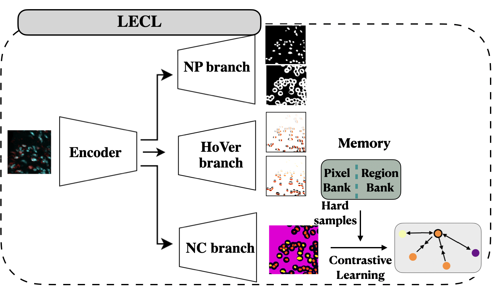

# HoVer-Net Inference for ImmunoFluorescence Images

This code is used to detect and classify the nuclei in immunofluorescent images.



Samples of the outputs are provided in the output folder.

## Usage (results of the model for a single marker):

To use the code on a new dataset, please follow the stages below:

1- Please save the data, including the fluorescent images in TIFF format and the associated Region of Interest (ROI) files in ROI format, within directories named "TIFF_wsi" and "LesionROI". Each pair of fluorescent and ROI images should have identical names and should not contain underscores (i.e., '_').
Please ensure that your directory tree exactly matches the following chart:

```none 
├── Inference_LECL
├── test_data
│   ├── LesionROI
│   ├── TIFF_wsi
```

2- Please set the parameters in the run_inference.slurm file as follows:
a- time: the running time

b- gres: the type of GPU; the current value is set to gpu:a6000:1

c- A: set the partition accordingly

d- nuclei_channel_image: set the channel corresponding to nuclei in the fluorescent images

e- marker_channel_image: set the channel corresponding to the marker in the fluorescent images

f- root: set the directory to the location of the Inference_LECL

g- test_list: set the name of the image 

h- marker_name: set the name of the marker. You may use this name when you set the "list_markers_name" parameter in the next stage 

3- Please run the run_inference.slurm file using the following command:
sbatch run_inference.slurm

The output including the excel and image files will be saved in the following directories:

```none
├── test_data
│   ├── output
│   │   ├── output_infer
│   │   │   ├── results_final
│   │   │   ├── results_final_90985-19B
```


## Usage (intergrating the results of multiple marker)

1- First, run the previous step (i.e., Usage - results of the model for a single marker) for each marker, such as Lineage Tracing, EdU, etc., using the provided dataset.

2- Please set the parameters in the integration.slurm file as follows:

a- root: Set the directory to the location of the "test_data" file

b- img_name: Set the name of the image in this format: 20X_name_of_the_image.tif.csv

c- list_markers_name: Set the names of the channel markers you want to integrate. Note that these marker channels have the same names as those set in step 2-h of the previous procedure

3- Please, run the below command to integrate the results over different markers. 

sbatch integration.slurm

The excel file output will be saved in the following directories:

```none
├── test_data
│   ├── integrated_results
```

# Weights
Please download the weights using the link below:

https://drive.google.com/drive/u/1/folders/1XkBIxiPY0gFEVzJmUBl_8CeW0-6ZIgNY


# Citation

1- Moradinasab, N., Deaton, R.A., Shankman, L.S., Owens, G.K. and Brown, D.E., 2023, October. Label-efficient Contrastive Learning-based model for nuclei detection and classification in 3D Cardiovascular Immunofluorescent Images. In Workshop on Medical Image Learning with Limited and Noisy Data (pp. 24-34). Cham: Springer Nature Switzerland.

2- Moradinasab, N., Sharma, Y., Shankman, L.S., Owens, G.K. and Brown, D.E., 2022, December. Weakly Supervised Deep Instance Nuclei Detection using Points Annotation in 3D Cardiovascular Immunofluorescent Images. In Machine Learning for Healthcare Conference (pp. 565-584). PMLR.


# Acknowledgements

We have used code from following open-source repositories.

HoVer-Net (https://github.com/vqdang/hover_net)

ContrastiveSeg (https://github.com/tfzhou/ContrastiveSeg)

